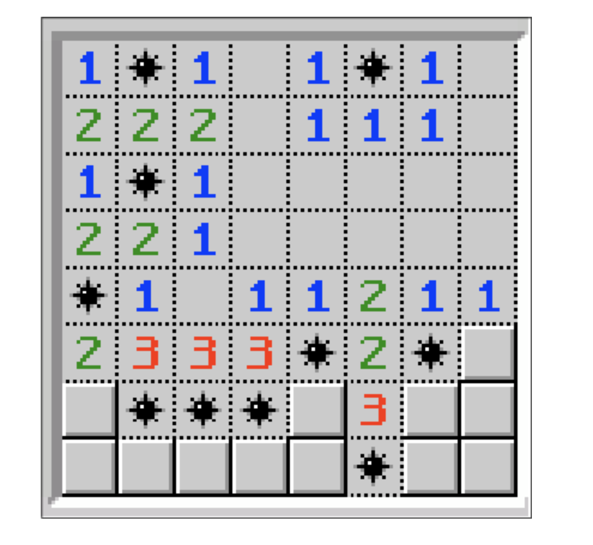

# Flex-box

Cet exercice est effectué dans le cadre de ma deuxième semaine de formation au centre de formation BECODE. 
Nous sommes en janvier 2021.

## Technos utilisées:
HTML5
CSS3

## Auteurs: 
Juste moi :)

## Instructions:
Pour cet exercice je dois fait un jeu minefiled avec principalement flex-box. 

Le temps accordé est de 1 journée. 

## But à atteindre :

## Projet déployé: 
Lien Github : 

Lien web: 
